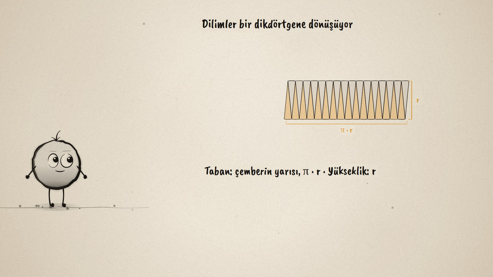
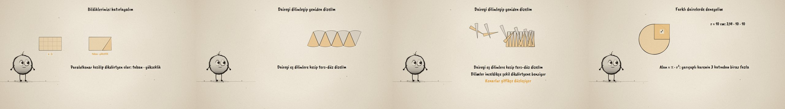

# Daireyi Dilimle · The Area of a Circle

**▶ Tarayıcıda izleyin / Watch in the browser:** https://hakanatas.github.io/daireyi-dilimle/ 
**⬇ MP4 + altyazılar / MP4 + subtitles:** [Releases](https://github.com/hakanatas/daireyi-dilimle/releases) 
**✎ Kullanılan istem / The prompt behind it:** [PROMPT.md](PROMPT.md) 
**🎞 Bütün filmler / All films:** [Nokta'nın Filmleri](https://hakanatas.github.io/nokta-filmleri/?sinif=7)

> **TR —** 7. sınıf matematik "Geometrik Nicelikler" temasındaki MAT.7.4.7 öğrenme çıktısı için hazırlanmış, tamamen JavaScript ile çizilen 92 saniyelik mürekkep animasyonu. Dairenin alanı karelerle sayılamıyor, çünkü kenarı eğri. Önce bilinenler hatırlanıyor: dikdörtgenin alanı a · b, paralelkenardan kesilen üçgen öbür yana taşınınca dikdörtgen oluyor (taban · yükseklik), çemberin uzunluğu 2 · π · r. Sonra daire 8, 16 ve 32 eş dilime kesilip bir yukarı, bir aşağı diziliyor; dilimler inceldikçe şekil bir dikdörtgene benziyor. Tabanı çemberin yarısı (π · r), yüksekliği yarıçap (r): alan π · r · r = π · r². Çıkarım farklı örneklerde değerlendiriliyor: r = 10 cm için 314 cm² (yarıçaplı karenin 3 katından biraz fazla), r = 5 cm için 78,5 cm². Altyazılar Türkçe, İngilizce ya da ikisi birlikte seçilebilir.

A 92-second ink animation for **7th-grade maths**. Nokta, the ink character from [The Learning Ink](https://github.com/hakanatas/the-learning-ink), is the guide again. `slices(n)` in `scenes/scene1.js` cuts the circle into any number of slices and moves each one from its place in the circle to its place in the row (apex and angle interpolated along the short turn), so 8, 16 and 32 slices are the same call with a different `n`.

## Learning outcome

MEB, Türkiye Yüzyılı Maarif Modeli, Ortaokul Matematik, 7th grade, "Geometrik Nicelikler" theme:

**MAT.7.4.7. Dikdörtgenin, paralelkenarın alanına ve çemberin uzunluğuna ilişkin deneyimlerini dairenin alan bağıntısına yansıtabilme**
- a) Dikdörtgenin, paralelkenarın alanı ve çemberin uzunluğuna yönelik deneyimlerini gözden geçirir.
- b) Dikdörtgenin alan bağıntısı ve çemberin uzunluğundan yola çıkarak dairenin alan bağıntısına yönelik çıkarım yapar.
- c) Çıkarımını farklı örnekler üzerinden değerlendirir.

## Scenes

| # | Time | Scene | What happens | Outcome |
|---|---|---|---|---|
| 1 | 0–10 s | Bir daire | How big is a circle? Squares do not fit its curved edge. | a |
| 2 | 10–28 s | Hatırla | Rectangle a · b, a parallelogram cut into a rectangle, circumference 2 · π · r. | a |
| 3 | 28–46 s | Dilimle | 8, 16 and 32 slices lined up alternately look more and more like a rectangle. | b |
| 4 | 46–64 s | Dikdörtgen | Base π · r (half the circumference), height r: area π · r². | b |
| 5 | 64–80 s | Dene | r = 10 cm: 314 cm², a little over three r² squares; r = 5 cm: 78,5 cm². | c |
| 6 | 80–92 s | Aklında kalsın | Area of a circle = π · r². | a–c |

## Running it

- **Preview:** double-click `index.html` (it works offline).
- **MP4:** run `npm install` once, then `npm run export -- --format=horizontal --captions=tr`.
- **Subtitles and narration:** `npm run srt` writes `out/captions_*.srt` and `narration_notes.txt`.
- **Editing:**
  - Caption text, timings and narration notes: `captions.js`
  - Everything on screen is drawn by `LI.world(t)` in `scenes/scene1.js` (the shapes, the slices, the words); the other scenes only set the camera.
  - Nokta's poses: `src/draw/film.js`; layout for 16:9 and 9:16: `src/draw/kd.js`

It uses the same engine as The Learning Ink: `renderFrame(t)` as a pure function of time, seeded randomness, and frame-by-frame export.
